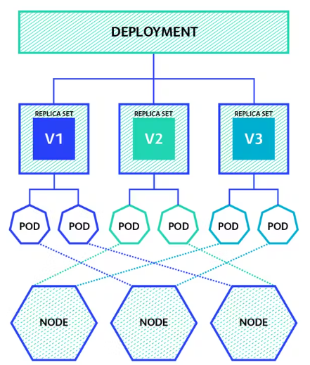
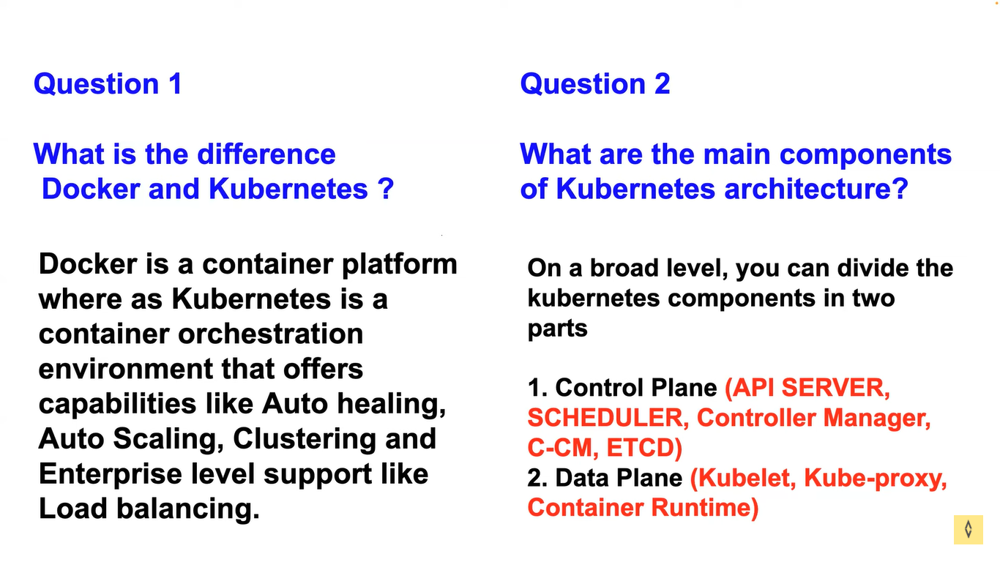
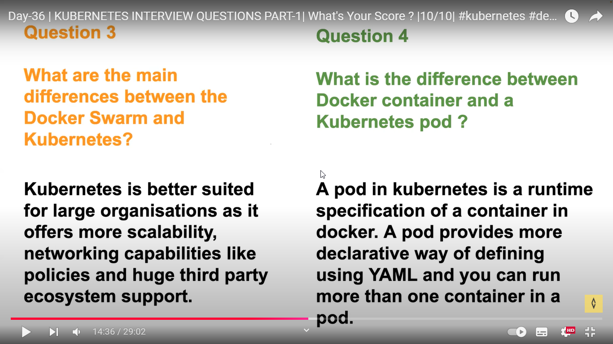
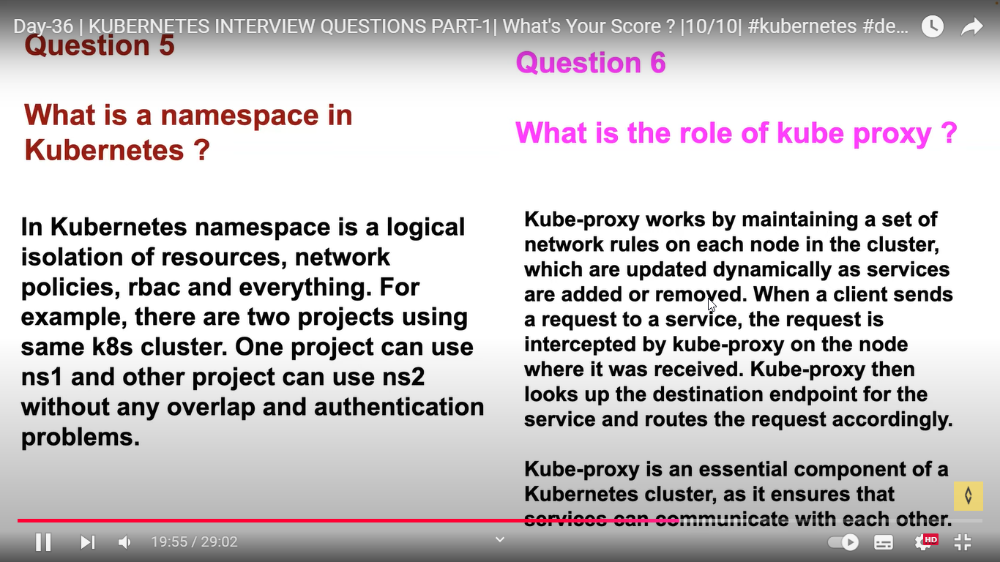
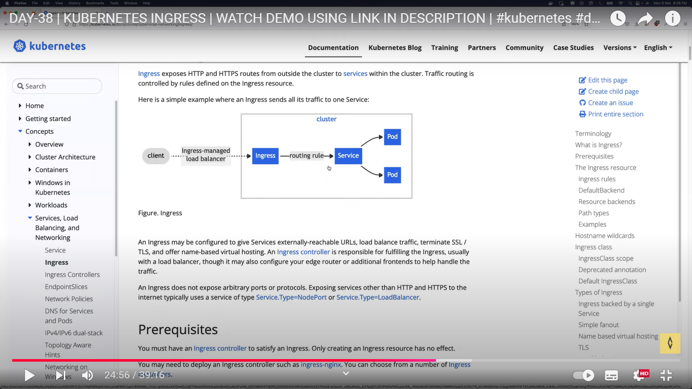

# Kubernetes

Kubernetes is an future of DevOps

* Docek is an container platform . it provide container lifecycle.
* Kubernetes is an container orgastaratoinal platform.


## issues of not using the kubernetes.

1.  single host nature

    * If we not use the kubernties , docker only depends on only one server. assume if we have 100 containers in one single host, if the cpu spike more then container will dont have space to run.

    * Kubernetes solve this issue we can span around multiple host

2. no auto heal
 
    * if any one kill our conatiner then the appliaction become unavailable, unless and until DevOps engineer come and trun back it to run.
 
    * Kuberneties have the solution for this to automatically heal the dead container  back to run state.

 3. no Auto Scaling

     * Docker doesn't have the mechanism of auto scaling, but k8 have that.

 4. Entrerprice level missing

    * docker doesn't have enterprice level support, k8 have that


## issues solved using K8s


single host nature

    * K8 is an cluster , cluster means group of nodes. but the container is run on a single host.

* if one faulty container is affecting a other container in the host like high cpu, so the k8 make it run on another node.

auto healing:

* kuberneties control and fix the damage 
* if any reason the container went down, it will rollout  the new container . using api server


enterprice:

* K8 is orginated from google  Borg, the people at google created  enterprice level container orgaztartional platform. docker independently never use in production.

* k8 have firewall suport ,api entrypoint, it have ddos attack so and so on.


# K8s architecture


1. Kube KubeProxy - networking, ip address, loadbalanccing
2. KUBELET - creation of pod , pod is in running state . monitoring the state and inform to kubenters api
3. container runtime  - runnig container

BY defalt cluster in nature

it have multiple master and slave node

Our requests alwys goes to control plane | maseter node

In Kubernetes we deploy POD incase of docker it is container

## Worker Node | Data plane  componenets:

* In a docker we need to have container run time to run our container , Docker shim is a docker run time.
* In K8s have component KUBELET, it is always maintain the pod, It is responsible for the POD is running. in case if any thing happen to POD it will inform to the sepecific components
* In K8s we can use runtime not only docker runtime (Docker shim), we can use any container runtime.


KubeProxy:

* Network is madoratory to run the POD
* Every POD we careating is should have allocate with the IP address, it give deafult load balancing capabilites as well.


## Master Node | Container plane Components:

*  It will take all the incomming requests
*  API server - expose our K8s to the external world, all the req recieved here. 
*  Sheduler - shedule our pod / resourse in a K8s , like it will choose shedule this on node1 or node2 the information from API server
*  ETCD -  KEY value store , it will store all the cluster information.
*  Controller manager - To support autoscaling and so and so , it will manage all the things.
*  Cloud Controller manager (CCM) - It is a Open Source Utility . When we run our K8s in Cloud platform like AWS. it is used to trasntalte what to do in the different platform. 
   Ex: if i am created new cloud platform and try to support K8s in that, we need to modeify the  CCM code and update and make it work on our cloud prvoider


# K8s Production system

learn it from another repo of zero to hero -  https://github.com/iam-veeramalla/Kubernetes-Zero-to-Hero


## Cluster

* Cluster is the place that conatains the whole things need to be run container.
* A Kubernetes cluster consists of a control plane plus a set of worker machines, called nodes, that run containerized applications. Every cluster needs at least one worker node in order to run Pods.


* We can create cluster using KOPS 

* Kubernetes Operations (kOps) is a free, open-source tool that helps you manage Kubernetes clusters in the cloud

```
kops create cluster --name=demok8scluster.k8s.local --state=s3://kops-abhi-storage --zones=us-east-1a --node-count=1 --node-size=t2.micro --master-size=t2.micro  --master-volume-size=8 --node-volume-size=8
```

* we are using the kubectl to control the lifecycle of pods and deployment.


## PODS

* Pods are the smallest level of deployment.
* In K8s we create an container as pod, pod can contain one or more dependent containers, so that help to interact with these containers easily using local host, aloso used to share the same volume.
* In K8s everything is written as .yamal manifest
* pods doesn't provide the auto healing and auto scaling. so we don't create PODs directly in prod  env.
* we can use pods for the tesing purpose


ex: pod.yaml
```
apiVersion: v1
kind: Pod
metadata:
  name: nginx
spec:
  containers:
  - name: nginx
    image: nginx:1.14.2
    ports:
    - containerPort: 80
```

## Deployments

* In the prod we always will use deployment to deploy our pods for provide the auto healing and auto scaling.
* In the deployment we will provide all the details as .yaml manifets. so with the use of Replica Set (RS), it will generate the pods as per the .yaml
* Replica Set is a K8s controller. it is responsible for the auto scalling and auto healing.
* Replica Set always check the .yaml manifest and if any changes happend in the pods, it will suddenly make changes to mach the .yaml manifest configuration.
* ex: in the .yaml i have mentioned count =3, so it will create 3 replication of PODs , if any one of pods get failed due to some network isssue, when it closing at the time it self new pod will be create.




Example deployment.yaml
```
apiVersion: apps/v1
kind: Deployment
metadata:
  name: nginx-deployment
  labels:
    app: nginx
spec:
  replicas: 3
  selector:
    matchLabels:
      app: nginx
  template:
    metadata:
      labels:
        app: nginx
    spec:
      containers:
      - name: nginx
        image: nginx:1.14.2
        ports:
        - containerPort: 80
```


## Service (SVC)

1. load balancing :
    * In case we have cretaed 3 pods using deployment RS , if any pod go down RS will create new pod but the ip will change so if we directly  connect to the ip address our application wont be accessibele.
    *  so service is work as a load balancer, the loads comes to the service and it will pass to the pods


2. auto discovery:
    * service service using labels & selector to get the pods. so even the the pods deleted and created it will be tracked by labels and selector , lables wont change.
    * we should mention label & selector in as mentadata in .yaml .selector will check the label that attached with the pod. label is like tag 
3. Expose to the external world :
    * There is 3 deafult options we can create a service in yaml manifest:
        1. Cluster IP - only access inside k8s cluster
        2. NodePort - it will allow apllication access inside our oragnisation, who have the access to worker node/ ec2 instance can access the application . node:port to accesss the  application .,
        3. loadbalancier - expose to the externalworld, using public ip address.







kubectl apply -f <deployment.yml>   - to run the yml file to create pods in k8s 
kubectl get deploy - to get thede tails of deployment
kubectl get pods -o wide - to see the all details
kubectl delet pod <pod name>

curl -l http://containerip:port - to connect the application 

kube ctl get svc- to get the service details
kube ctl edit svc <nane> - to edit the configuration of service that already in place


info: 

by the minikube we can't create the public load balancer becasue. if we use like from aws or azure they have managed their cloud control manger to connect with their aws component to create an public  ip but in the case of minicbe they doesn't have those contribution. so we can use it for the testing env.

# INGRESS

* before 2015 there is no option like ingress, that time all used to expose the application using service.
* The service giving very simple load balancing that was roundrobin. that was very simple.
* from the people from instcne they have enterprice level load balancing  such as
    1. Weighted round robin - An improvement on the round robin algorithm that considers the priority of each task before assigning it to a virtual machine. 
    2. Least connections  - A dynamic load balancing algorithm that assigns incoming traffic to the server with the fewest open connections. 
    3. location based 
    4. path  based
    5. ratio based
* cloud provider will charge you the number of load balancer.
* there is lot of ingress controler avilable on the market like nginix for the load balancing.
* what the ingress of k8s say is you can choose  ingress controller that available on the market, they have the documentation page how to use. by using that you
* in the ingress in k8s you can specify the routing type and the target service location
* 



# RBAC (role based access control)

* K8S providing the RBAC such as
    1. Service account /user
    2. Roles/ cluster role
    3. Role binding / CRB 


  ### users

  * K8S not providing the user management. offlload the identitity provider to any other like IAM or TESTRAIL  (RBAC) 

  ### Service account

  * We can also define a access that to the applications that running using RBAC
  * when ever we create pod in k8s it will create an default scalling
  * we can create an service account using yaml 


### Role

  * role is a ymal file having all the permission. 

### Role binding
  * Role binding used to attach the role with user/ Service Account


#  Custom resource 

    1. Custom resource definition (CRD)
    2. Custom resource (CR)
    3. Custom controller 
 

 * This is used to add new service into the k8s like Argocd 
 * we can add new api resouce to the k8s 

###  Custom resource definition (CRD)

 * define a new type of api to k8s in ymal file. and validate the custom resource
* CR will be created by developer, and that checked by the custom  controller.
* controller will be created by DevOps , it can be write by go lang, python ( go lang is widely used)

### watcher : if we doing any action like dleete create, it have all the watches it wil recieved


# config  map amd secrets:

### config  map

 * used for saving secrets  non sensible information  in k8s ,after we can use that by pods or deploymnet .. so the application in the pod can use that
 * we can save the values under here as env variabe or volume mount
 * we can chnage the env varibale. so use the volume mount for that 
 * IF WE CHANGE THE CONFIG MAP. THAT MAKE CHANGES ON CINFUG MAP WILL UPDT
### secrets

* it will save the secret sensible data in secretes, so it wont save in ETCD. it will encrypted


# k8s monitoring

promethiuous and grafana,

we can get the logs by prometious and visualize that by grafana

prometious can be installed by the helm chart 
