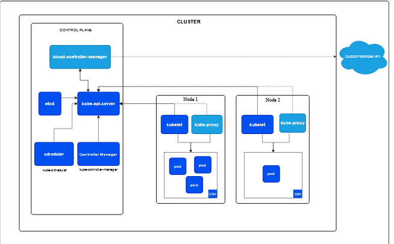

# Kubernetes

Kubernetes is an future of DevOps

* Docek is an container platform . it provide container lifecycle.
* Kubernetes is an container orgastaratoinal platform.

## issues of not using the kubernetes.

1.  single host nature

    * If we not use the kubernties , docker only depends on only one server. assume if we have 100 containers in one single host, if the cpu spike more then container will dont have space to run.

    * Kubernetes solve this issue we can span around multiple host

2. no auto heal
 
    * if any one kill our conatiner then the appliaction become unavailable, unless and until DevOps engineer come and trun back it to run.
 
    * Kuberneties have the solution for this to automatically heal the dead container  back to run state.

 3. no Auto Scaling

     * Docker doesn't have the mechanism of auto scaling, but k8 have that.

 4. Entrerprice level missing

    * docker doesn't have enterprice level support, k8 have that

## issues solved using K8s

single host nature

    * K8 is an cluster , cluster means group of nodes. but the container is run on a single host.

* if one faulty container is affecting a other container in the host like high cpu, so the k8 make it run on another node.

auto healing:

* kuberneties control and fix the damage 
* if any reason the container went down, it will rollout  the new container . using api server

enterprice:

* K8 is orginated from google  Borg, the people at google created  enterprice level container orgaztartional platform. docker independently never use in production.

* k8 have firewall suport ,api entrypoint, it have ddos attack so and so on.

# K8s architecture

1. Kube KubeProxy - networking, ip address, loadbalanccing
2. KUBELET - creation of pod , pod is in running state .
3. container runtime  - runnig container

BY defalt cluster in nature

it have multiple master and slave node

Our requests alwys goes to control plane | maseter node

In Kubernetes we deploy POD incase of docker it is container

## Worker Node | Data plane  componenets:

* In a docker we need to have container run time to run our container , Docker shim is a docker run time.
* In K8s have component KUBELET, it is always maintain the pod, It is responsible for the POD is running. in case if any thing happen to POD it will inform to the sepecific components
* In K8s we can use runtime not only docker runtime (Docker shim), we can use any container runtime.

KubeProxy:

* Network is madoratory to run the POD
* Every POD we careating is should have allocate with the IP address, it give deafult load balancing capabilites as well.

## Master Node | Container plane Components:

*  It will take all the incomming requests
*  API server - expose our K8s to the external world, all the req recieved here. 
*  Sheduler - shedule our pod / resourse in a K8s , like it will choose shedule this on node1 or node2 the information from API server
*  ETCD -  KEY value store , it will store all the cluster information.
*  Controller manager - To support autoscaling and so and so , it will manage all the things.
*  Cloud Controller manager (CCM) - It is a Open Source Utility . When we run our K8s in Cloud platform like AWS. it is used to trasntalte what to do in the different platform. 
   Ex: if i am created new cloud platform and try to support K8s in that, we need to modeify the  CCM code and update and make it work on our cloud prvoider

# K8s Production system

learn it from another repo of zero to hero -  https://github.com/iam-veeramalla/Kubernetes-Zero-to-Hero

## Cluster

cluster us used to

